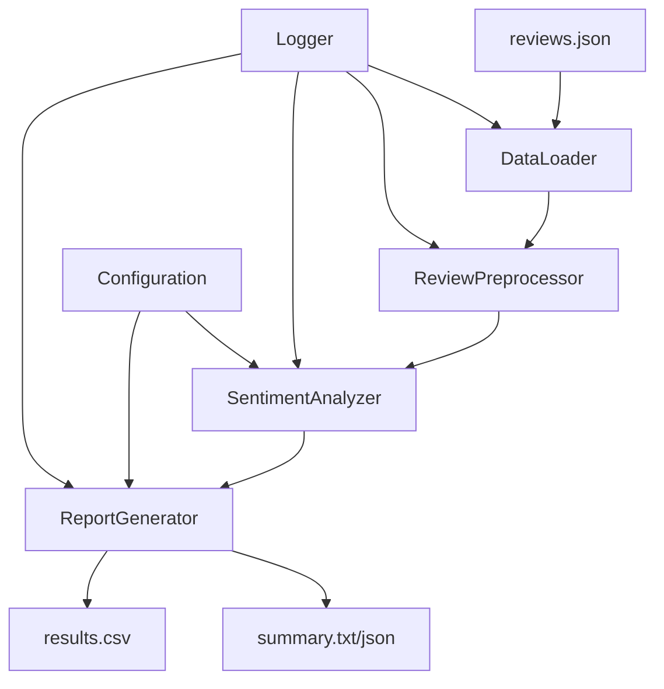

# Design Document - Sentiment Analysis Engine

## Overview

The sentiment analysis engine is designed as a modular Python application that processes customer reviews through a configurable pipeline. The system uses a layered architecture with clear separation of concerns, enabling easy maintenance and extensibility. The core design emphasizes robustness, performance, and adherence to object-oriented principles.

## Architecture

The system follows a pipeline architecture with the following main components:

```
Input (reviews.json) → Data Loader → Preprocessor → Sentiment Analyzer → Report Generator → Output Files
```

### High-Level Architecture Diagram



## Components and Interfaces

### 1. Core Data Models

#### Review Class
```python
@dataclass
class Review:
    review_id: str
    review_text: str
    sentiment_score: Optional[float] = None
    sentiment_label: Optional[str] = None
    processing_errors: List[str] = field(default_factory=list)
```

#### SentimentResult Class
```python
@dataclass
class SentimentResult:
    total_reviews: int
    positive_count: int
    negative_count: int
    neutral_count: int
    positive_percentage: float
    negative_percentage: float
    neutral_percentage: float
    processing_errors: List[str]
```

### 2. Data Loading Layer

#### DataLoader Interface
```python
class DataLoaderInterface(ABC):
    @abstractmethod
    def load_reviews(self, file_path: str) -> List[Review]:
        pass
```

#### JSONDataLoader Implementation
- Handles JSON parsing with robust error handling
- Manages encoding issues (UTF-8, Latin-1 fallback)
- Validates required fields (review_id, review_text)
- Creates Review objects with error tracking

### 3. Preprocessing Layer

#### ReviewPreprocessor Class
- Text cleaning and normalization
- Handles empty/null text cases
- Emoji and special character processing
- Text length validation
- Encoding standardization

Key Methods:
- `preprocess_text(text: str) -> str`
- `handle_empty_text(review: Review) -> Review`
- `normalize_encoding(text: str) -> str`

### 4. Sentiment Analysis Layer

#### SentimentAnalyzer Interface
```python
class SentimentAnalyzerInterface(ABC):
    @abstractmethod
    def analyze_sentiment(self, reviews: List[Review]) -> List[Review]:
        pass
```

#### VaderSentimentAnalyzer Implementation
- Uses VADER (Valence Aware Dictionary and sEntiment Reasoner)
- Configurable thresholds for classification
- Handles French text through preprocessing
- Batch processing for efficiency

**Sentiment Classification Logic:**
- Positive: compound score > 0.05
- Negative: compound score < -0.05  
- Neutral: -0.05 ≤ compound score ≤ 0.05

**Rationale for VADER:**
- Handles social media text, emojis, and punctuation well
- No training required (lexicon-based)
- Fast processing suitable for real-time analysis
- Good performance on short texts like reviews

### 5. Configuration Management

#### ConfigManager Class
```python
class ConfigManager:
    def __init__(self, config_path: str = "config.json"):
        self.positive_threshold: float
        self.negative_threshold: float
        self.output_format: str
        self.log_level: str
```

Default Configuration:
```json
{
    "sentiment_thresholds": {
        "positive": 0.05,
        "negative": -0.05
    },
    "output": {
        "summary_format": "json",
        "results_format": "csv"
    },
    "logging": {
        "level": "INFO",
        "file": "sentiment_analysis.log"
    }
}
```

### 6. Report Generation Layer

#### ReportGenerator Class
- Generates summary statistics
- Creates detailed CSV output
- Handles multiple output formats
- Calculates percentages with proper rounding

Key Methods:
- `generate_summary_report(results: SentimentResult) -> None`
- `generate_detailed_report(reviews: List[Review]) -> None`
- `calculate_statistics(reviews: List[Review]) -> SentimentResult`

## Data Models

### Input Data Schema
```json
{
    "review_id": "string (required)",
    "review_text": "string (required, can be empty)"
}
```

### Output Data Schemas

#### Summary Report (JSON)
```json
{
    "analysis_summary": {
        "total_reviews": 50,
        "sentiment_distribution": {
            "positive": {"count": 20, "percentage": 40.0},
            "negative": {"count": 15, "percentage": 30.0},
            "neutral": {"count": 15, "percentage": 30.0}
        },
        "processing_info": {
            "timestamp": "2025-10-31T10:00:00Z",
            "errors_count": 2,
            "configuration": {
                "positive_threshold": 0.05,
                "negative_threshold": -0.05
            }
        }
    }
}
```

#### Detailed Results (CSV)
```csv
review_id,review_text,sentiment_final,sentiment_score
REV001,"Excellent produit...",Positive,0.8516
REV002,"Le service client...",Negative,-0.7269
```

## Error Handling

### Error Handling Strategy

1. **Graceful Degradation**: System continues processing even when individual reviews fail
2. **Comprehensive Logging**: All errors logged with context and timestamps
3. **Error Aggregation**: Collect and report all processing errors in final output
4. **Fallback Mechanisms**: Default values for failed operations

### Error Categories

#### Data Loading Errors
- File not found → Clear error message, suggest file path
- Invalid JSON → Log malformed entries, continue with valid ones
- Encoding issues → Try multiple encodings, log conversion attempts

#### Processing Errors  
- Empty review text → Assign neutral sentiment, log occurrence
- Analysis failures → Skip review, log error, continue processing
- Memory constraints → Process in batches, implement streaming if needed

#### Output Errors
- File write permissions → Clear error message with suggested solutions
- Disk space issues → Check available space, provide meaningful feedback

## Testing Strategy

### Unit Testing Approach

#### Test Coverage Areas
1. **Data Loading Tests**
   - Valid JSON parsing
   - Malformed JSON handling
   - Encoding edge cases
   - Empty file scenarios

2. **Preprocessing Tests**
   - Text normalization
   - Empty text handling
   - Special character processing
   - Emoji handling

3. **Sentiment Analysis Tests**
   - Known positive/negative/neutral examples
   - Edge cases (very short text, numbers only)
   - Threshold boundary testing
   - Batch processing validation

4. **Report Generation Tests**
   - Statistics calculation accuracy
   - Output format validation
   - File creation and content verification
   - Error case handling

#### Test Data Strategy
- Create synthetic test datasets with known sentiment labels
- Include edge cases from the actual reviews.json
- Test with various file sizes and formats
- Validate against manual sentiment annotations

### Integration Testing
- End-to-end pipeline testing with sample data
- Configuration loading and application
- File I/O operations under various conditions
- Error propagation through the pipeline

### Performance Testing
- Processing time benchmarks for 50+ reviews
- Memory usage profiling
- Scalability testing with larger datasets
- Resource constraint simulation

## Implementation Considerations

### Dependencies Management
```
# Core dependencies
vaderSentiment==3.3.2
pandas==2.1.0
numpy==1.24.0

# Development dependencies  
pytest==7.4.0
pytest-cov==4.1.0
black==23.7.0
flake8==6.0.0
```

### Project Structure
```
sentiment_analysis_engine/
├── src/
│   ├── __init__.py
│   ├── models/
│   │   ├── __init__.py
│   │   └── review.py
│   ├── data/
│   │   ├── __init__.py
│   │   └── loader.py
│   ├── preprocessing/
│   │   ├── __init__.py
│   │   └── preprocessor.py
│   ├── analysis/
│   │   ├── __init__.py
│   │   └── sentiment_analyzer.py
│   ├── reporting/
│   │   ├── __init__.py
│   │   └── report_generator.py
│   ├── config/
│   │   ├── __init__.py
│   │   └── config_manager.py
│   └── utils/
│       ├── __init__.py
│       └── logger.py
├── tests/
├── config.json
├── requirements.txt
├── main.py
└── README.md
```

### Performance Optimizations
- Lazy loading for large datasets
- Vectorized operations where possible
- Efficient memory management for batch processing
- Caching of preprocessed text when beneficial

### Extensibility Design
- Plugin architecture for different sentiment analyzers
- Configurable output formats
- Modular preprocessing pipeline
- Support for additional languages through configuration